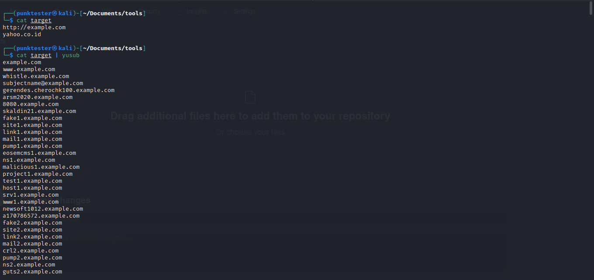

# yusub


just subdomain enumeration from yuyu scanner 
## Source 
i'm use 12 API for get good result 
```` 
https://otx.alienvault.com
https://api.certspotter.com
http://index.commoncrawl.org
https://crt.sh
https://dnsdumpster.com
https://api.hackertarget.com
https://rapiddns.io/
https://riddler.io
https://api.threatminer.org
https://threatcrowd.org
https://urlscan.io/
https://sonar.omnisint.io/

````
## installation 
- pip install -r requirements.txt
- chmod +x yusub
- sudo mv yusub /usr/local/bin
## usage
- yusub target.com 
- cat targetlist.txt | yusub | some program u wanna run
- yusub target.com | some program u wanna run

## example
- cat targetlist.txt | yusub | httpx -silent > result.txt
- yusub target.com | httpx -silent > result.txt
